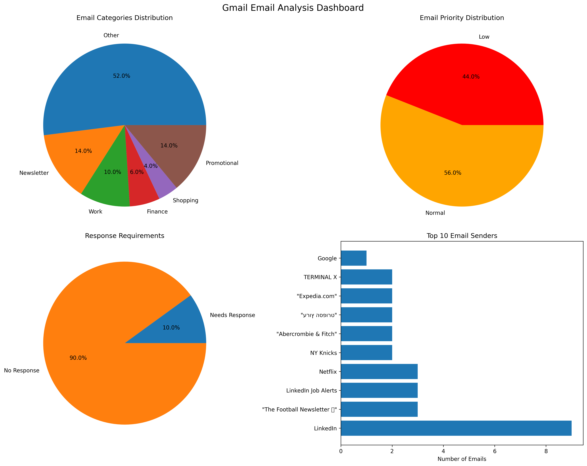

# 📬 Gmail AI Helper

### Classify your inbox with a local LLM, cache the results in Redis, and see it all in a dashboard

> Exercise 2 for the **From Idea To Reality – App Using AI** course

**Gmail AI Helper** connects to your Gmail account (read-only), pulls your latest inbox emails and asks a small language model running **locally on your machine** to classify each one: what kind of email it is, how urgent it is, and whether it needs a reply. Results are cached in Redis so repeated runs are fast, and the final analysis is printed as a summary and drawn as a visual dashboard.

No email content is sent to an external AI service. The model runs entirely on your own computer.

---

## ✨ Features

- **Gmail integration**: reads the 50 most recent inbox emails through the Gmail API, using read-only access.
- **Local LLM classification**: uses [`Qwen2.5-0.5B-Instruct`](https://huggingface.co/Qwen/Qwen2.5-0.5B-Instruct) through Hugging Face Transformers, on GPU if available and CPU otherwise.
- **Structured JSON output**: a system prompt with category definitions and a few-shot example guides the model to return clean JSON.
- **Robust parsing with fallback**: several strategies extract JSON from the model's output. If none succeed, a keyword-based classifier takes over, so every email always gets a result.
- **Redis caching**: each analysis is cached for 8 hours, so emails that were already analyzed are not sent to the model again.
- **Summary and dashboard**: a text summary in the terminal plus a four-chart dashboard saved as an image.

---

## 🏷️ Classification

For each email the model returns:

| Field | Possible values |
|---|---|
| `category` | Work, Shopping, Personal, Promotional, Newsletter, Social (plus Finance and Other from the fallback) |
| `priority` | Urgent, Important, Normal, Low |
| `response_needed` | `true` / `false` |

Example model output:

```json
{
  "reason": "Automated shipping confirmation for purchased item.",
  "category": "Shopping",
  "priority": "Normal",
  "response_needed": "No"
}
```

---

## 📊 Example Dashboard



The dashboard shows the category distribution, priority distribution, how many emails need a response, and the top 10 senders.

---

## ⚙️ How It Works

```
Gmail API ──► fetch 50 inbox emails (sender, subject, snippet)
                  │
                  ▼
            Redis cache hit? ──yes──► use cached analysis
                  │ no
                  ▼
       Local LLM (Qwen 2.5 0.5B) ──► parse JSON
                  │                      │ failed
                  │                      ▼
                  │             keyword-based fallback
                  ▼
        save to cache (8h TTL)
                  │
                  ▼
     terminal summary + dashboard + JSON results
```

The cache key is an MD5 hash of the sender, the subject and the start of the email preview.

---

## 🛠️ Tech Stack

- Python
- Hugging Face Transformers + PyTorch (local LLM)
- Gmail API (`google-api-python-client`, `google-auth-oauthlib`)
- Redis (caching)
- Matplotlib (charts)

---

## 📁 Project Structure

```
├── gmail_ai_helper.py      # Main app: Gmail fetch, LLM analysis, caching, charts
├── hello_llm.py            # Sanity check: run Qwen 2.5 0.5B locally
├── hello_llm2.py           # Sanity check: run TinyLlama 1.1B locally
├── requirements.txt
└── outputs/
    └── gmail_analysis_charts.png
```

---

## 🚀 Getting Started

### Prerequisites

- Python 3.9+
- Redis (optional but recommended; without it the app still runs, just without caching)
- A Google Cloud project with the Gmail API enabled

### 1. Clone the repository

```bash
git clone https://github.com/Lavie-Zanzuri/Exercise-2---Gmail-AI-helper.git
cd Exercise-2---Gmail-AI-helper
```

### 2. Install dependencies

```bash
python -m venv venv
source venv/bin/activate        # On Windows: venv\Scripts\activate
pip install -r requirements.txt
```

The model (about 1 GB) is downloaded automatically from Hugging Face on the first run.

### 3. Set up Gmail API access

1. Go to the [Google Cloud Console](https://console.cloud.google.com/) and create a project.
2. Enable the **Gmail API**.
3. Configure the **OAuth consent screen** and add your Gmail address as a test user.
4. Create an **OAuth client ID** of type **Desktop app** and download it.
5. Rename the file to `credentials.json` and place it in the project folder.

On the first run a browser window opens to sign in. After that a `token.json` file is saved so you don't need to sign in again. Both files are in `.gitignore` and must never be committed.

### 4. Start Redis

```bash
# macOS
brew install redis && brew services start redis

# or with Docker
docker run -d -p 6379:6379 redis
```

### 5. Run

```bash
python gmail_ai_helper.py
```

To test that the local model works before connecting to Gmail:

```bash
python hello_llm.py
```

---

## 📤 Output

- A summary printed to the terminal: category and priority breakdown, urgent emails and emails needing a response.
- `outputs/gmail_analysis_charts.png`: the dashboard image.
- `outputs/email_analysis_results.json`: the full analysis of every email.

---

## 🔒 Privacy

- Gmail access is **read-only** (`gmail.readonly` scope); the app cannot send, delete or modify emails.
- Email content is processed **locally** and never sent to an external AI API.
- `credentials.json`, `token.json` and `.env` are excluded from Git.

---

## 👤 Author

**Lavie Zanzuri** – [GitHub](https://github.com/Lavie-Zanzuri)
